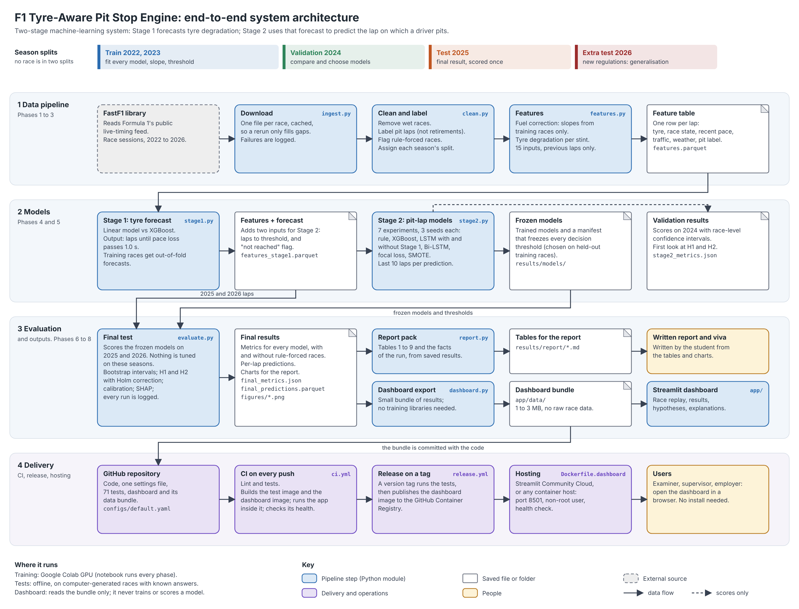

# F1 Tyre-Aware Pit Stop Engine

Final-year Computer Science project: a two-stage machine-learning system that forecasts Formula 1 tyre
degradation (Stage 1) and uses that forecast to predict pit-stop laps (Stage 2), built on official
F1 timing data through [FastF1](https://docs.fastf1.dev).

**Research question:** does adding an explicit tyre-degradation forecast improve machine-learning
prediction of pit-stop laps?

## Architecture



An editable copy of the diagram is in `docs/architecture.svg`.

## Status

| Phase | What | Status |
| --- | --- | --- |
| 0 | Repository, tests, Docker, CI | Done |
| 1 | Download and cache race data | Done |
| 2 | Clean races and label pit laps | Done |
| 3 | Fuel correction, degradation and model features | Done |
| 4 | Stage 1 degradation model | Done |
| 5 | Stage 2 pit decision models, baselines, H1/H2 tests | Done |
| 6 | Final evaluation on 2025 and 2026: calibration, explanations, report charts | Done |
| 7 | Streamlit dashboard and deployment | Done |
| 8 | Report pack: every table and data fact for the written report | Done |

## Quick start

```bash
git clone <your-repo-url> f1-pit-engine
cd f1-pit-engine
python -m venv .venv && source .venv/bin/activate
pip install torch --index-url https://download.pytorch.org/whl/cpu   # skip if you have a GPU build
pip install -e ".[dev,dl,app]"
pytest                      # 72 tests, run offline in about two minutes

make pipeline               # download -> clean -> features -> stage1 -> stage2 (first download takes a long time)
```

Or step by step:

```bash
python -m f1pit.ingest                       # every completed race in configs/default.yaml
python -m f1pit.ingest --seasons 2022 2023   # only some seasons
python -m f1pit.clean                        # -> data/processed/laps_clean.parquet
python -m f1pit.features                     # -> data/processed/features.parquet, fuel_slopes.json
python -m f1pit.stage1                       # -> data/processed/features_stage1.parquet, results/stage1_metrics.json
python -m f1pit.stage2                       # -> results/stage2_metrics.json, stage2_validation_predictions.parquet, models/
python -m f1pit.stage2 --experiments rule_based xgboost lstm_tyre_aware lstm_no_stage1   # only some
python -m f1pit.evaluate                     # final test, run once -> results/final_metrics.json, tables, figures/
python -m f1pit.report                       # tables and data facts for the written report -> results/report/
python -m f1pit.race_poster --race 2025_05   # one-page race analysis poster -> results/figures/ (--list shows races)
python -m f1pit.dashboard                    # export the results for the dashboard -> app/data/
streamlit run app/streamlit_app.py           # the dashboard, http://localhost:8501
```

**On Google Colab:** open `notebooks/Run_Pipeline_Colab.ipynb`, choose a GPU runtime and run all cells.
It installs the package, keeps data and results in your Google Drive, runs every phase and shows the
results tables. The final test is switched off there until you set `RUN_FINAL_TEST = True`.

Set `quick: true` in `configs/default.yaml` for a fast trial run on the first few races of each season.
Re-running `ingest` only downloads races that are missing, so it is safe to run again after a failure.

**Cloud computers.** The Formula 1 timing service refuses many requests from cloud computers such as
Google Colab and CI runners. For those races `ingest` reads the same FastF1 lap table from the
TracingInsights archive on GitHub (see "Data source") and prints `(from tracinginsights)`. `MISS` lines
are races neither source has yet, usually the most recent ones; to add them, run
`python -m f1pit.ingest` on a home or university connection and copy `data/races/*.parquet` to where
the pipeline runs (on Colab: `MyDrive/f1_project/pipeline/data/races/`). Saved races are never
downloaded again.

With Docker:

```bash
docker build -t f1pit .
docker run --rm f1pit                                                # run the tests
docker run --rm -v "$PWD/data:/app/data" f1pit python -m f1pit.ingest   # download into ./data
```

## Stage 1: tyre degradation

For every lap, Stage 1 estimates how many more laps the stint can run before its fuel-corrected pace
loss passes a threshold (1.0 s by default; 0.5 s and 1.5 s are also scored). Two models are compared on
the validation season:

- **Linear:** degradation rises by a fixed rate per lap, one rate per compound, or per circuit and
  compound where a circuit has enough training laps. Simple and explainable.
- **XGBoost:** gradient-boosted trees using stint age, tyre age, compound, temperatures, traffic and
  circuit, constrained so predicted degradation never falls as the stint ages.

Both are scored on forecasts 1, 5 and 10 laps ahead (against a "no further wear" reference) and on how
many laps their threshold prediction is off. The linear model is kept unless XGBoost is at least 1%
better on the 5-lap forecast. Tree models cannot extrapolate beyond the tyre ages they were trained on,
which matters for high thresholds that few stints reach; the metrics report this honestly.

## Stage 2: pit decisions and the hypotheses

Every model predicts, for every lap, whether the driver pits at the end of it, using only what was
known before the lap ended. Seven experiments run under one protocol:

| Experiment | What it is | Role |
| --- | --- | --- |
| `rule_based` | Pit on the lap tyre age reaches the circuit's typical stop age for the compound (median, rounded up) | Simple baseline |
| `xgboost` | Gradient-boosted trees on the current lap's features, no memory of earlier laps | H2 baseline |
| `lstm_tyre_aware` | LSTM over the last 10 laps, with the Stage 1 forecast | Main model |
| `lstm_no_stage1` | The same LSTM without the Stage 1 forecast | H1 ablation |
| `bilstm_replica` | Published Bi-LSTM (Sasikumar et al., 2025), leakage-free | Published benchmark |
| `lstm_tyre_aware_focal` | Main model with focal loss | Class-imbalance study |
| `lstm_tyre_aware_smote` | Main model with SMOTE-balanced training windows | Class-imbalance study |

**Protocol.** Models are fitted on training races. A fixed 20% of training races is held out for early
stopping and for choosing each model's decision threshold, so the 2024 validation season never tunes
anything and its scores are honest. Neural models and XGBoost are trained with three seeds; the table
reports the seed-averaged probability, and per-seed means and spreads are saved too.

**Statistics.** PR-AUC is the headline metric (with this few pit laps, accuracy and ROC-AUC look
flattering). Confidence intervals resample whole races, because laps within a race are not independent.
H1 and H2 are judged with a paired race-level bootstrap of the PR-AUC difference and McNemar's test:

- **H1:** `lstm_tyre_aware` vs `lstm_no_stage1`, which only differ in the Stage 1 forecast.
- **H2:** `lstm_tyre_aware` vs `xgboost`, same inputs, with and without sequence memory.

**Replicating the published Bi-LSTM.** Same layer sizes, optimiser, learning rate, batch size, 10-lap
windows, SMOTE and 1:3 class weights. Two deliberate differences: SMOTE is applied to training windows
only (the paper's workflow applies it before splitting), and PyTorch has no recurrent dropout, so
dropout is applied between layers. Its scores are therefore expected to differ from the published ones.

**Run time.** The published Bi-LSTM (256 units, batch size 32) dominates training time and is slow on a
laptop CPU; use a GPU (the Colab notebook) or pass `--experiments` to run a subset. Set
`stage2.mlflow: true` and `pip install -e ".[track]"` to log every run to MLflow.

## Final evaluation on the held-out seasons

`python -m f1pit.evaluate` scores the 2025 test season and the 2026 extra-test season. No model,
threshold or setting is fitted or tuned on those seasons: it loads the trained models and
`results/models/manifest.json`, in which Stage 2 froze every decision threshold, the rule-based
baseline's stint table and the list of held-out training races. Two things are fitted at this step,
both from training races only: the calibration curves described below, and an identical refit of the
selected Stage 1 model so its forecasts can be scored.

| Output | What it holds |
| --- | --- |
| `results/final_metrics.json` | Every number below, per season and group of races |
| `results/final_model_table.csv` | One row per season, group of races and model (validation included) |
| `results/final_hypothesis_table.csv` | H1, H2 and the Bi-LSTM comparison on every season |
| `results/final_predictions.parquet` | Per-lap scores, decisions and calibrated probabilities |
| `results/figures/*.png` | Model comparison, hypothesis tests, PR curves, calibration, SHAP, permutation importance, an example race |
| `results/final_evaluation_log.json` | A record of every evaluation of the test seasons |

**Two groups of races.** The headline results leave out the rule-forced races (Monaco 2025 and Qatar
2025), because their stops were set by regulation and no model was trained on such races. The same
numbers for all dry races are reported next to them as a sensitivity check. The choice was fixed in
`configs/default.yaml` before any test data was scored.

**Hypothesis tests.** The same paired race-level bootstrap and McNemar test as on validation. Because
two hypotheses are tested, Holm-adjusted p-values are reported for H1 and H2. Bootstrap p-values use
(count + 1) / (resamples + 1), so they are never exactly zero. With fewer than 10 races the output
carries a warning: the intervals are then too narrow to support a conclusion. A hypothesis whose two
models were not both trained is listed as not tested.

**Calibration.** Models trained with class weights or SMOTE rank laps well but overstate the pit
probability. The evaluation reports the Brier score and expected calibration error as trained and
after Platt scaling. The Platt curve is fitted on the held-out training races, never on test data,
and it does not change the ranking, so PR-AUC is unaffected.

**Explanations.** XGBoost: exact SHAP values (TreeSHAP, built into XGBoost), with the direction of
each feature's effect where it is clear (correlation of at least 0.1 between value and effect). LSTM: permutation importance, the drop in PR-AUC when a feature is shuffled.
The two Stage 1 inputs are also shuffled together, which shows how much the main model relies on the
degradation forecast, a second line of evidence for H1 beside the ablation.

**Also reported:** recall for stops made under a safety car and under green-flag running, and the
Stage 1 forecast errors on the same seasons.

**Safeguards.**

- The loaded models must reproduce the validation scores and decisions Stage 2 saved. If the feature
  files or models have changed since training, the run stops and asks for Stage 2 to be rerun.
- Models trained in `quick` mode are refused (`--allow-quick` overrides, and is logged).
- Every evaluation is written to the log. If the same trained models have already been evaluated on
  the same held-out laps, the saved results are shown and the tables and charts are redrawn from them;
  `--rerun` forces a new evaluation. Retrained models or newly downloaded races (the 2026 season is
  still running) are evaluated and logged. If the log shows more than one evaluation, say so in the
  report and explain why.
- `make pipeline` does not run the final evaluation. Run `make evaluate` when the models are final.
- Stage 2 run with `--experiments` keeps only the named experiments in the manifest. Train everything
  you want evaluated in one Stage 2 run.

## Report pack

`python -m f1pit.report` writes the tables for the written report from the saved results, so no number
is typed by hand:

| File | Contents |
| --- | --- |
| `results/report/data_facts.md` | Table 1 (races, laps and pit laps per split) and the facts of the run: models, races removed, download failures, fuel slope, Stage 1 model chosen, number of evaluations of the test seasons |
| `results/report/results_tables.md` | Tables 2 to 9: Stage 1 accuracy, Stage 2 on validation, the final test (headline and sensitivity), hypothesis tests, calibration, explanations, safety car versus green flag |

Every table states how many races it rests on and carries a warning when there are too few to support
a conclusion. P-values below 0.001 are written as `<0.001`. The charts for the report are in
`results/figures/`.

### Race analysis poster

`python -m f1pit.race_poster --race 2025_05` draws one dark, eight-panel page for a single race
(`--list` shows the races available; `make poster RACE=2025_05` does the same). An example drawn from
practice data is in `docs/race_poster_example.png`.

| Panel | Drawn from |
|---|---|
| Lap time, top five finishers | `LapTime_s` |
| Tyre strategy, in finishing order | `Stint`, `Compound` |
| Position by lap | `Position` |
| Gap to the race leader | `Time_s` |
| Tyre degradation by tyre age | `Degradation_s` on clean laps: median and middle half per compound |
| Stage 1 forecast for the winner | `LapsToThreshold` |
| Stage 2 pit decision | saved model scores and decisions, with the real stops marked |
| Race summary | best lap, average clean lap, stops and tyres for the top ten |

Safety-car and virtual-safety-car laps are shaded. `--model xgboost` (or any other experiment) changes
the model shown. The Stage 2 panel is left empty for training races, because a model's score on a race
it learned from is not evidence. The poster has no tyre-temperature, top-speed or driver-rating panel:
the public timing data has no tyre temperatures, this project does not download speed-trap values, and
a rating would have to be invented.

## Dashboard

`streamlit run app/streamlit_app.py` opens the dashboard. Until you export your own results it shows
computer-generated practice data, under a warning banner; `python -m f1pit.dashboard` replaces that
with your final results (`app/data/`).

| Tab | What it shows |
| --- | --- |
| Overview | Headline scores on the test season and the reading of H1 and H2 |
| Race replay | Step through a held-out race lap by lap: each driver's tyre, tyre age, Stage 1 forecast, pit probability and the model's call, then reveal what really happened |
| Model results | Every model with confidence intervals, for each season and group of races |
| Hypotheses | The PR-AUC differences behind H1 and H2 on every season, with their intervals and p-values |
| Why the models decide | SHAP values, permutation importance and calibration curves |
| About | The method, the fairness rules and the data source |

The replay is not a live feed: it replays races the models have already scored. Every value shown for
a lap was computed from laps before it ended. Until you tick "reveal", the table and the driver
timeline stop at the chosen lap and show only stops already made
(`test_pit_wall_shows_only_what_was_known`, `test_reveal_timeline_and_scorecard`).

The app reads only the exported bundle, so the deployed version installs five small packages and no
training libraries. Deployment (Streamlit Community Cloud or Docker), the CI checks and the release
workflow are described in [docs/DEPLOYMENT.md](docs/DEPLOYMENT.md).

## Data splits

| Split | Seasons | Used for |
| --- | --- | --- |
| Train | 2022, 2023 | Fitting models, fuel slopes, typical stint lengths, decision thresholds and calibration |
| Validation | 2024 | Comparing and choosing models; honest scores before the final test |
| Test | 2025 | Final results, run once |
| Extra test | 2026 | Generalisation to the new regulations, run once |

Splits are by season, so no race is in two splits. The config refuses overlapping splits.

## How leakage is prevented

Each rule below is enforced in code and checked by a test.

- **Fuel slopes come from training races only** and are applied unchanged to other seasons
  (`test_fuel_slopes_come_from_training_races_only`, `test_validation_races_use_training_slopes`).
- **No feature uses a later lap.** Features for laps 1 to L are identical whether or not later laps
  exist (`test_no_feature_uses_future_laps`).
- **Race length is the scheduled distance**, which teams know before the start, not the number of laps
  actually run, which is only known afterwards if a race is stopped early
  (`test_race_length_is_the_scheduled_distance`). Races downloaded before this was added fall back
  to the laps run; delete `data/races` and run `ingest` again to refresh them.
- **The pit lap's own time and position are never inputs**, because they already show the stop.
  The model sees the previous lap's values.
- **Stage 1 inputs to Stage 2 are out-of-fold.** Each training race's `LapsToThreshold` comes from a
  model fitted on the other training races (`test_out_of_fold_never_predicts_a_race_it_was_fitted_on`),
  and projections use only laps already completed (`test_projection_uses_no_future_laps`).
- **A retirement into the pits is not a tyre stop** (`test_retirement_into_pits_is_not_a_pit_stop`).
- **Only tyre stops made as a race decision are pit laps.** A pit entry is not a pit lap when the same
  tyre set carries on (the field was routed through the pit lane behind the safety car, or a penalty
  was served) or when the visit lasted more than five minutes (a red flag or a garage repair). In the
  2022 to 2026 data this removes 311 of 2,901 pit entries: 208 without a tyre change and 103 during a
  suspension (`test_only_tyre_stops_made_as_a_race_decision_are_pit_laps`). The cleaning step prints
  both counts.
- **The test seasons tune nothing.** Decision thresholds, calibration curves and the rule-based stint
  table come from training races only. Flipping every test label leaves every prediction unchanged
  (`test_test_labels_cannot_change_any_prediction`, `test_decisions_use_the_frozen_thresholds`).
- **Wet races are removed** and **rule-forced races are flagged** (Qatar 2023, Monaco 2025, Qatar 2025),
  so stops forced by rules rather than tyre wear do not distort training.
- **Every race must be a real race.** The cleaning step stops if two race files hold the same laps
  (same drivers, tyres and positions on every lap), which is what happens when one race is copied
  under another season's name. Altering the lap times does not hide a copy
  (`test_a_race_copied_into_another_season_is_refused`). A season that cannot be downloaded stays
  missing until the real races are downloaded; it is never filled with copies of another season.

## Repository layout

```
configs/default.yaml   settings for every script
src/f1pit/
  config.py            load and check settings
  ingest.py            Phase 1: download and cache races
  clean.py             Phase 2: clean, label pit laps, flag races
  features.py          Phase 3: fuel correction, degradation, features
  stage1.py            Phase 4: degradation models, laps-to-threshold projection
  stage2.py            Phase 5: pit-decision models, experiments, H1/H2 comparisons
  evaluate.py          Phase 6: final evaluation of the frozen models on the held-out seasons
  plots.py             charts for the report, drawn from the saved results
  dashboard.py         Phase 7: exports results for the dashboard and prepares its tables
  archive.py           second data source: FastF1 lap tables from the TracingInsights archive
  report.py            Phase 8: tables and data facts for the written report
  race_poster.py       one-page race analysis poster for a chosen race
  metrics.py           PR-AUC, F1, pit window, race-level bootstrap, McNemar, Holm, calibration
app/                   Streamlit dashboard, its requirements, and demo data
docs/DEPLOYMENT.md     how to deploy the dashboard
docs/EXTERNAL_SOURCES.md  other projects reviewed, and why their data is not used
scripts/               audit of third-party lap files
Dockerfile             image that runs the tests
Dockerfile.dashboard   image that serves the dashboard
tests/                 pytest suite; synthetic.py fakes FastF1 so tests run offline
notebooks/             Colab notebooks: explore the training data; run the full pipeline on a GPU
.github/workflows/     CI: lint, tests, both Docker images, dashboard health check; release to GHCR on a tag
```

## Data source

Timing data comes from the FastF1 Python library, which reads Formula 1's public live-timing feed.
FastF1 is unofficial software and is not associated with Formula 1. Downloaded data is not committed
to this repository; the pipeline rebuilds it.

The timing service refuses many requests from cloud computers (Google Colab, CI runners). For races
FastF1 returns nothing for, `f1pit.ingest` reads the same FastF1 lap table from the
[TracingInsights archive](https://github.com/TracingInsights-Archive) on GitHub (MIT licence) and marks
the race `Source = "tracinginsights"`. The archive was checked against direct FastF1 downloads before
it was accepted; the checks and its limits are in `docs/EXTERNAL_SOURCES.md`. `--no-archive` uses FastF1
only. The download prints, and the report pack records, how many races came from each source.
